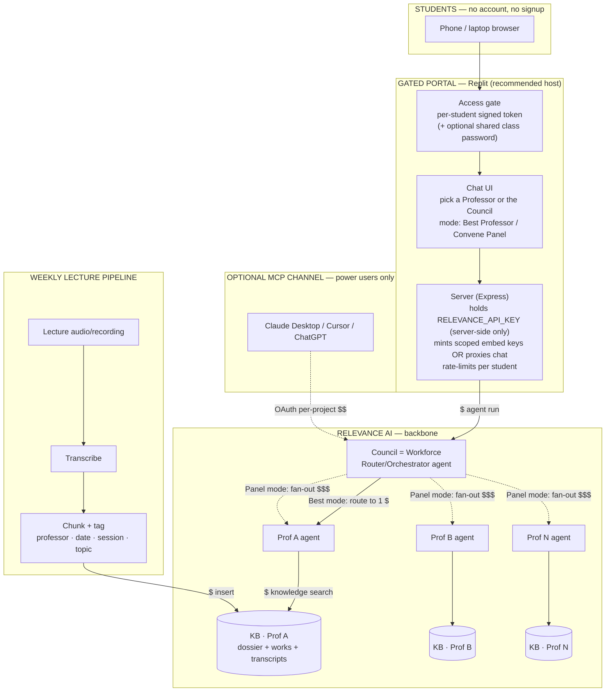

# Professor Council — Project Plan

**YPO Stanford 2026 · AI versions of each class professor (individual + panel), no student accounts**

> Status: **PLAN — awaiting your approval.** No implementation code has been written and no
> live Relevance calls have been made. Phase 0 environment files (this plan, `.env.example`,
> `.gitignore`, `README.md`, `scripts/`) are scaffolded. Reply **"approved"** to start building.

All Relevance capabilities below were verified against the current docs (June 2026). Doc pages
are cited inline. Anything I could **not** confirm is listed in §9 as an open question rather than
asserted.

---

## 1. Architecture



**Where credits are spent** (`$` markers above; see §6 for caps):

| `$` point | What it is | Relevance cost type |
|---|---|---|
| Student message → professor/Council | An **agent run** | Actions + Vendor Credits (LLM) |
| **Panel / Convene Council** | Runs **N professor agents per question** (~N× a single answer) | Actions + Vendor Credits × N — **biggest multiplier** |
| Knowledge search (RAG) | Each retrieval the agent performs | Action + Vendor Credits |
| Weekly transcription | Native step (Vendor Credits, possibly external key) **or** external AssemblyAI (billed by AssemblyAI) | Vendor Credits and/or external bill |
| Knowledge insert/storage | Adding transcript rows | Vendor Credits / storage |
| MCP power-user calls | Agent/tool runs **billed to your account** | Actions + Vendor Credits |
| Embed-key generation / portal hosting | Minting keys is free; hosting is a Replit cost | Not Relevance credits |

> "An Action is counted when an agent runs a tool." · "Vendor Credits cover LLM and tool usage
> costs at wholesale." — Relevance docs: [Pricing](https://relevanceai.com/docs/get-started/pricing)

---

## 2. Component inventory

### Relevance AI assets to create
| Asset | Naming | Notes |
|---|---|---|
| **Knowledge base — one per professor** | `kb_prof_<slug>` | Holds (a) dossier, (b) papers/books/public work, (c) lecture transcripts (added weekly). Metadata columns: `source_type` (dossier\|work\|transcript), `date`, `session`, `topic`, `title`. |
| **Professor agent — one per professor** | `agent_prof_<slug>` | Persona from the dossier; connected to its **own** KB with "Allow agent to search" (RAG). Instructions: stay in-domain, ground answers in retrieved sources, state when unsure, identify as an AI persona. |
| **Council** | `workforce_council` | A **Workforce** with a Router/Orchestrator agent as entry point; AI-connected to the professor agents. Implements the two modes (route-to-best, convene-panel). |
| **Tools** (as needed) | `tool_insert_transcript`, optional `tool_transcribe` | Insert-Knowledge step for the pipeline; native Convert-audio-to-text only if we use the native path. Built-in agent "Allow agent to search" may remove the need for a custom search tool. |

### Application & jobs (this repo)
| Component | Where | Purpose |
|---|---|---|
| **Gated portal** | Replit (frontend + Express server) | No-account student access; holds the API key server-side; mints embed keys / proxies chat; per-student rate limits. |
| **Lecture pipeline** | `scripts/ingest-lecture.mjs` (built in Phase 4) | Weekly: audio → transcript → chunk + tag → insert into the correct professor's KB. |
| **Token admin** | `scripts/manage-tokens.mjs` (Phase 1/5) | Generate and revoke per-student access links. |
| **Connectivity check** | `scripts/check-connection.mjs` (**now**) | Single safe **read-only** call (`Agent.getAll()`); no agent run, no credits. |

---

## 3. The five decisions — recommendations

**1) Council mechanism → use a Workforce (not Subagents).**
Relevance explicitly labels subagents a "legacy feature [that] may be deprecated soon" and says
"If you wish to build a multi-agent system, we recommend using the Workforce feature instead."
A Workforce's **AI Connections** let "the agent decide when to pass control to another agent based
on context" (ideal for *route-to-best-professor*) and supports conditional logic + multi-agent
fan-out for the *panel*, with "no hard limit on the number of agents."
Cites: [Subagents](https://relevanceai.com/docs/build/agents/build-your-agent/agent-settings/subagents) · [Workforces](https://relevanceai.com/docs/get-started/core-concepts/workforces).

**2) Portal host → Replit (primary); Lovable + Supabase is the viable alternative.**
The Relevance SDK is a Node JS/TS package that must run server-side with the `sk-` key; Replit gives
one environment with an Express backend + AES-256 **Secrets** to hold the key, run the SDK, build the
custom per-student gate, and mint embed keys. Lovable is faster to a polished UI but pushes
server-side secrets into **Supabase edge functions (Deno)**, an extra moving part where the Node SDK
may need replacing with raw REST calls — so Replit wins on *clean SDK integration + one place for the
secret*, which is what this build needs.
Cites: [SDK auth](https://relevanceai.com/docs/sdk/authentication) · [Replit Secrets](https://docs.replit.com/core-concepts/project-editor/app-setup/secrets) · [Lovable + Supabase](https://docs.lovable.dev/integrations/supabase).
(Replit caveat from docs: workspace Secrets must be **re-added in the Deployments pane** — #1 cause of "undefined key" in prod.)

**3) Transcription → external AssemblyAI feeding Relevance via API (default); native step only for short clips.**
The native Convert-audio-to-text step caps at **~60 MB** ("If you are working with large video files,
use … QuickTime to extract the audio") and the OpenAI model option "requires an OpenAI API Key" — a
full lecture often exceeds that. AssemblyAI handles hours-long audio asynchronously with speaker
diarization, then a small weekly script chunks + tags + inserts the text into the right KB — the
lowest-effort *reliable* path. If lectures are captured on a meeting platform, **Fireflies** is the
zero-upload alternative.
Cites: [Convert audio/video to text](https://relevanceai.com/docs/build/tools/tool-steps/convert-audio-video-to-text) · [Fireflies](https://relevanceai.com/docs/integrations/popular-integrations/fireflies).

**4) Portal auth/gating → per-student signed "capability" links (default), with an optional shared class password.**
Each student gets a unique, unguessable URL carrying an HMAC-signed token (server-validated). This
needs **no signup**, can be **revoked individually** when a link leaks (re-issue just that student),
and lets us **rate-limit per token** to cap credits — directly satisfying your "leaked link can be
revoked" requirement. A single shared class password can sit on top as a coarse second factor;
roster magic-links are more secure but add friction + store more PII, so they're an upgrade, not the
default. This matters because the raw Relevance share link is "a public URL that … anyone can share"
with "zero authentication barriers."
Cites: [Share your agent](https://relevanceai.com/docs/build/agents/share-your-agent).

**5) RAG structure → one Knowledge base per professor (with metadata tags inside each).**
Per-professor bases give clean grounding and make it impossible for one professor's agent to retrieve
another's material (a single shared base relies on a filter being correct on every query — one bug
leaks content). Within each base we still tag rows (`date`, `session`, `topic`) and use Knowledge
Search **raw filters** ("you can use raw filters … `exact_match` … pass an array … to create OR
semantics") for date/topic scoping. Weekly transcripts simply append to that professor's base.
Cites: [Create knowledge](https://relevanceai.com/docs/build/knowledge/create-knowledge) · [Knowledge search](https://relevanceai.com/docs/build/tools/tool-steps/knowledge/knowledge-search).

---

## 4. Build phases (prove ONE professor end-to-end first)

| # | Goal | Assets / files created | How you verify | Effort |
|---|---|---|---|---|
| **0** | Environment ready (no live calls) | `PROJECT_PLAN.md`, `.env.example`, `.env`, `.gitignore`, `README.md`, `scripts/check-connection.mjs`, `package.json` | After you add the key: `npm install && npm run check` lists your agents via a **read-only** call (no credits). | **Done** (your part: ~15 min) |
| **1** | **One professor, end-to-end (the pilot)** | 1 KB (`kb_prof_<pilot>`) loaded with dossier + 1 sample transcript (tagged); 1 agent (`agent_prof_<pilot>`); minimal gated portal (gate + chat to that one agent) on Replit; one manual run of the ingest path | You open your personal gated link, ask a question, get an answer **grounded in the transcript**; a revoked link stops working while others keep working. | ~1–2 days |
| **2** | Scale to all professors | Repeat KB + agent per professor from a template | Each professor answers in-domain and only from its own materials | ~0.5 day/professor |
| **3** | Council (Workforce) + two modes | `workforce_council` + router; "Best Professor" and "Convene Panel" | Business question routes to the right professor; panel returns a synthesized multi-professor answer. **Cost check:** confirm panel ≈ N× single. | ~1–2 days |
| **4** | Weekly lecture pipeline | `scripts/ingest-lecture.mjs` (transcribe → chunk → tag → insert) | One command ingests a week's lecture into the correct KB with correct metadata; agent cites it within minutes | ~1 day |
| **5** | Security & cost hardening | Usage Limits + conservative Spend Controls; per-token rate limits; revoke flow; PII-safe logging | Hit a test cap and confirm hard-stop + alert email; revoke a token live | ~0.5 day |
| **6** | *(Optional)* MCP channel for power users | Documented MCP connection + scoping | A power user reaches the professors from their own client — **only after** the §9 exposure question is resolved | ~0.5 day |

Each phase ends with a check-in for your review before the next begins.

---

## 5. The no-account student experience (step by step)

1. **You distribute access** — either one personal link per student (recommended) or one class link + a shared password. (I generate these; you paste them into your roster email / class page.)
2. **Student taps the link** on any phone or laptop. The portal opens and the gate validates the token automatically (or asks once for the class password). **No signup, no email, no app.**
3. **Student sees the class portal**: a list of professors plus **"Ask the Council."**
4. **Student picks a mode**: *Ask the Best Professor* (routes to the most relevant one) or *Convene the Council* (a panel answer from several professors).
5. **Student asks a question** and gets a streamed answer grounded in that professor's papers and lectures; they can keep chatting.
6. **History stays in their browser** (localStorage) so they keep their conversation without an account.
7. **If a link leaks**, you revoke that one token; that student gets a fresh link; everyone else is unaffected and your credits are protected.

---

## 6. Security & cost

**Where the API key lives.** `RELEVANCE_API_KEY` (`sk-…`, full project access) is **server-side only**
— Replit Secrets in production, `.env` (git-ignored) in dev. Per the docs: "Never embed API keys in
client-side code, browser-accessible environment variables, or version control." The browser only
ever gets a **scoped embed key** minted server-side (per public agent), or never touches Relevance at
all because the server proxies chat. ([SDK auth](https://relevanceai.com/docs/sdk/authentication))

**How the gate works.** Per-student token = HMAC(`student_id`, `PORTAL_TOKEN_SECRET`) embedded in the
URL. The server recomputes/validates it on every request and checks it against an allow-list.

**Revoking a leaked link.** Remove that token id from the allow-list → the link dies immediately;
re-issue a new one to that student. Rotating `PORTAL_TOKEN_SECRET` invalidates **all** links (nuclear
option). Per-token rate limits (e.g., `PORTAL_MAX_MSGS_PER_STUDENT_PER_DAY`) cap worst-case spend even
before revocation.

**Relevance spend controls — set both, but know the difference:**
- **Usage Limits = the safety cap (use this).** Available on **all plans**, project-level, a true
  **hard stop** + email alerts, resets monthly. "Usage limits allow you to hard stop usage when you
  reach a specified limit." Recommended: set a monthly **credit budget** you choose for the term;
  alert emails at ~**60%** and ~**80%**, hard stop at **100%**.
  ([Usage limits](https://relevanceai.com/docs/admin/project-management/usage-limits))
- **Spend Controls = auto-recharge (set conservatively or OFF).** This **increases** spend by topping
  up when low ("you'll automatically be charged to bring your balance up to your minimum threshold +
  top-up amount"). Pro/Team only. During a class, prefer a **small** top-up + low threshold, or leave
  it off so Usage Limits is the real ceiling. ([Spend controls](https://relevanceai.com/docs/admin/subscriptions/spend-controls))

**Credit-aware design choices.** Panel mode is the biggest multiplier (N professors per question) —
we'll cap fan-out (e.g., top 3) and can gate "Convene Council" behind a soft per-student limit. I'll
flag cost before any step that spends credits or calls paid transcription.

**No PII.** Roster is sensitive: we log only a hashed token id, never roster emails, names, or message
content; nothing student-identifying goes in client code or git.

---

## 7. Consent & rights checklist — **launch-blockers**

Do not ingest any professor's materials or lectures until (a)+(b)+(c) are signed for that professor.

- [ ] **Per-professor written sign-off** on: (a) creating an **AI persona** of them; (b) **ingesting
      their research / books / public work / likeness** into RAG; (c) **recording + transcribing their
      lectures** into RAG.
- [ ] **Stanford** classroom-recording and lecture-IP permissions.
- [ ] **YPO** event recording permission / code-of-conduct compliance.
- [ ] **Third-party content licensing** — papers/books may be copyrighted; confirm rights to ingest.
- [ ] **Student-roster privacy** — notice/consent for storing the roster and mapping links to students.
- [ ] **Student disclosure** — clear "this is an AI persona, not the real professor" + accuracy
      disclaimer shown in the portal.

---

## 8. Inputs I need from you to start building

1. **Relevance access** — confirm your plan tier, then add to `.env`: `RELEVANCE_API_KEY` (`sk-…`),
   `RELEVANCE_REGION` (`us`/`eu`/`au`), `RELEVANCE_PROJECT_ID`. (Where to find each: §README + below.)
2. **Professor list** — names, a short slug each, and each one's domain/specialty.
3. **Pilot dossier** — one deep-research dossier for the professor we build first.
4. **Pilot transcript or audio** — one sample lecture (file or link) to prove the pipeline.
5. **Transcription choice + key** — AssemblyAI key (default), or "use Fireflies/Zoom," or an OpenAI key
   for the native path.
6. **Roster + distribution** — how many students and whether you want **per-student links** or a
   **shared class password**; how you'll distribute (email / class page / printed).
7. **Host confirmation** — Replit (recommended) or Lovable — plus **branding** (class name, logo, colors).
8. **Budget cap** — a monthly $ or credit ceiling so I can set the Usage Limit hard stop.

---

## 9. Open questions & risks (incl. things I could not confirm from docs)

1. **MCP exposure scope (important).** The MCP server authenticates a client to a **whole project**
   ("direct access to your agents, tools, and knowledge," "authentication is per project") via OAuth —
   so handing outside power users MCP access likely over-privileges them and bills you. Options to
   verify: an agent-scoped MCP exposure, or putting only "shareable" agents in a **separate locked-down
   project**, or restricting MCP to you alone. ([MCP server](https://relevanceai.com/docs/integrations/mcp/mcp-server))
2. **Unbroken-out credit costs.** The pricing page doesn't give per-action rates for **knowledge search**,
   **knowledge storage**, or **native transcription** — verify actual consumption in your dashboard
   before scaling.
3. **Knowledge-base count limits.** Docs don't state a max number of KBs per project/plan — confirm one
   base per professor is allowed on your tier.
4. **Embed-key attribution.** Confirm public-agent embed keys are per-agent scoped and that chats via
   them can be rate-limited/attributed per student (for §6 caps).
5. **Native transcription file cap.** ~60 MB ceiling — confirm your lecture file sizes; if larger,
   external AssemblyAI is required (matches the §3 recommendation).
6. **Lovable path only:** if you choose Lovable, verify the Relevance **Node** SDK runs in a Supabase
   **Deno** edge function, or plan to call Relevance via raw REST there instead.
7. **Connectivity check cost.** `Agent.getAll()` is a read/list call believed to consume **zero**
   credits (no agent run) — I'll confirm against your usage meter the first time you run it.
8. **Workforce availability** on your specific plan (to be confirmed when the key is added).

---

### Appendix — how the portal calls Relevance (verified SDK shape)

```ts
// SERVER-SIDE ONLY — never ships to the browser
import { createClient, Agent, REGION_US } from "@relevanceai/sdk";

createClient({
  apiKey: process.env.RELEVANCE_API_KEY,   // sk-...
  region: REGION_US,                        // from RELEVANCE_REGION
  project: process.env.RELEVANCE_PROJECT_ID,
});

const agent = await Agent.get("<agent-id>");
const task  = await agent.sendMessage("…student question…");   // $ agent run
task.addEventListener("message", ({ detail: { message } }) => {
  if (message.isAgent()) console.log(message.text);
});
```
Browser uses a **scoped embed key** minted server-side (`Key.generateEmbedKey({ region, project, agentId })`),
or the server proxies the chat so the browser never sees any Relevance key.
Cites: [SDK quickstart](https://relevanceai.com/docs/sdk/quickstart) · [SDK agents](https://relevanceai.com/docs/sdk/agents) · [SDK auth](https://relevanceai.com/docs/sdk/authentication).
